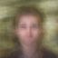
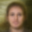
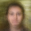
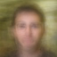
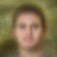

# 42-FaceGenerator

** You need to be a 42 student to use this project, you will need to log with your student account **

## What is this project ?

The goal of this project is to practice machine learning.

I want a neural network to learn what is the typical face of a 42 student, and give him random data to generate fake pictures of students.

We'll use an autoencoder for that.

## What is an autoencoder ?

I wanted to learn using an autoencoder : it' a neural network that takes an input and learn to compress it.
How does it works ?
It's a regular deep learning network, with layers like this :

Input layer : 1028
Hidden 1 : 64
Hidden 2 : 32
Hidden 3 : 64
Output layer : 1028

Of course number of neurons in each layer can change, but it has to have this double funnel shape.

We train the autoencoder to give as the ouput the same input we provided.

To sum up, the network learn to compress data by preserving data despite dimension reduction.

## Dataset

The dataset will be the pictures of the 42 Paris campus.

They have all the same size (175 pixels x 175 pixels), and more important, they have the same framing and the same background.
We want the neural network to focus only on the student faces, not on the environment, so that's perfect.

The script download_faces.py downloads and cleans the dataset. Be patient it's really slow !

## Requirements
- Tensorflow
- Pillow
- Numpy
- Progressbar

## Dev log

### Jan, 6th

Today I finished to collect data. I have now a full dataset of 3620 175x175 pictures of students (120M).

I made cleanup functions to remove pictures of piscine. We only want pictures of students as they all have exactly the same background which will be a huge advantage for our network ! Some pictures was empty, I removed them too. I also removed bot pictures.

I'am now ready to process this data.

I'll reshape them to 64x64, and normalize pixels value between -1 and 1 to speed convergence up.

Too sleepy to continue 😴, doing more interesting stuff tomorrow.

## Jan, 7th

Exploring a little bit the images I downloaded yesterday. One problem : I only deleted images with a height different than 175 to filter piscine pictures.

But images has different width, some are 175 and other are 131.

I'm thinking about cropping images to 131 pixels from the center. I'll test on different images to see if it's OK.

After looking multiple pictures, I figured out that each school 42 promotion has its own photo setup.

I think I will try with photos of my promotion first (late 2019), we have 769 pictures. I doubt it will be enough training example but let give it a try.

I have now a clean dataset. I filtered it manually, I deleted most of unframed pictures and staff custom pictures.
I would say the dataset is about 25% female and 75% male, but it's just an estimation.

We have now a clean 757 64x64 pictures dataset !

I now have a good view of the dataset, I think we are ready to make some machine learning !

First try, I will train a regular neural network, with 12288 --> 512 --> 32 --> 512 --> 12288

All hidden layers have relu activation, output will have sigmoid. I'll train with Adam and mse error function.

Note : 🎵 I'm listening to Dark Side of the Moon, great for coding ! 🎵

Here what I get after training this model :

I wasn't expecting to have a result that fast !

The faces aren't clearly defined, but maybe we can recognize some of the students :)

To see more easily how well the network is doing, here is my picture, and the picture created by the network :

Ok, maybe not so recognizable 😅

So what can we do now to make the neural network more precise ?

We can increase the size of the first hidden layer. I think it will make faces more sharps, but faces are still encoded in a 32 dimensions vector, so it won't help with face-likelyness. I'll try increasing a little bit the network, more power could be fun.

So I will try this structure :
12288 --> 2000 --> 32 --> 2000 --> 12288

Generated pictures are still blur and far from reality, so I don't post result here.

Now I will try a deeper network :
12288 --> 1024 --> 512 --> 32 --> 512 --> 1024 --> 12288

Praying that the learning won't be too long.

It took like five minutes, the result is better but not still as good as I want. Next try :
12288 --> 4048 --> 1024 --> 512 --> 32 --> 512 --> 1024 --> 4048 --> 12288

It starts to gte bigger, I hope it will converge fast enough.

The model trained in a couple of minutes. The result is better, but we still need more power. Here is my face, with the first model and the deeper one now :

As you can see, the generated picture is sharper, shadows are stronger and background is more defined.
Good improvement. I'd like to train wider network and also later try with CNN layers. Maybe we can also decrease the compression, maybe from 32 to 512. We don't have much data, so I'm a bit scared that the model will quickly overfit.

Trying now :
12288 --> 10000 --> 5000 --> 1000 --> 100 --> 1000 --> 5000 --> 10000 --> 12288
